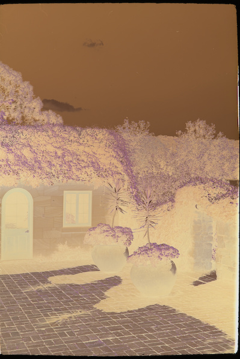
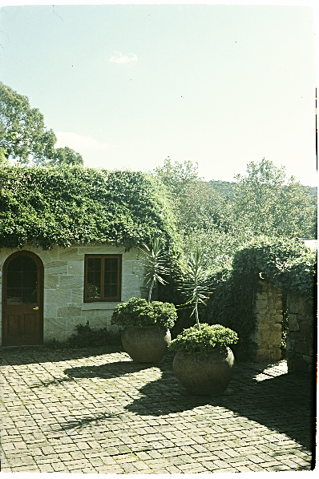
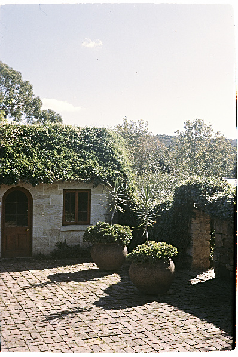

# Positif

Convert colour film negative digitised with DSLR to a positive image.

## Motivation

Colour film negatives can be digitised by taking an image of the negative placed on a light box with a digital camera.
Provided you have a camera with a proper lens, this technique is very inexpensive and fast compared to
scanning the negatives by a dedicated film scanner or having them digitised by a photographic lab.
The quality of the resulting digital capture is only limited by the specifications of your camera and lens.
Usually, they are on par or exceed those of the film scanners, including the professional machines used by the labs.

The main problem of the method is in converting the negative images to positives.
[Negative Lab Pro](https://www.negativelabpro.com/) is probably the best tool for the job. It is reasonably priced and
delivers excellent results. Unfortunately, Negative Lab Pro is a Lightroom plugin and requires a subscription to this product.
Not all film photographers use Lightroom. Some prefer [Darktable](https://www.darktable.org/),
[RawTherapee](https://www.rawtherapee.com/) and other free and open-source software. Both
Darktable and RawTherapee are capable of excellent results if you know how to use these tools.
The hardest part is achieving consistency between the frames shot on the same roll of film, different rolls shot on the same
film stock and between different films. At the end of the day, we are shooting film to get that special look that is almost
impossible to replicate digitally.

`Positif` is an experimental tool for converting RAW images of the film negatives taken by a digital camera to positive images.
The idea is to use transformation curves specific to the film, development process, the digital camera and the light source you use.

## Installation

`Positif` is a command-line tool that requires Python version 3.11 or above. It is installed from `PyPI` using `pip`:

```bash
pip install positif
```

## Usage

Run `positif -h` to get a full list of command line arguments. There are two major use scenarios. You can convert an
individual file, for example:

```bash
positif --raw="frame00000.ARW" --film=Ektar --output=frame00.tiff
```

Alternatively, you can process all RAW files in a directory and save the results in the destination directory, like that:

```bash
positif --raw="./capture" --format=ARW --film=Ektar --output="./results"
```

The `--format` parameter is required when converting all RAW files in a directory.

## Conversion Parameters

`positif` would normally create an output image which is a good starting point for further post-processing in your
favourite photo editing software. If you notice a consistent exposure offset, temperature bias or colour shift you can
use the conversion parameters described below to improve the resulting image.

| Parameter     | Description                                                                                                                                                                                                                                               |
| ------------- | --------------------------------------------------------------------------------------------------------------------------------------------------------------------------------------------------------------------------------------------------------- |
| --mid-level   | Middle grey level relative to full scale. If this parameter is not specified it is determined automatically based on the histogram of the image.<br> Values below 0.5 result in darker output image and vice versa. The allowed range is from 0.1 to 0.9. |
| --red         | Red channel adjustment. Positive corrections add red. Valid range is from -0.5 to 0.5. <br>Typical values are within &plusmn;0.1.                                                                                                                         |
| --green       | Green channel adjustment.                                                                                                                                                                                                                                 |
| --blue        | Blue channel adjustment.                                                                                                                                                                                                                                  |
| --temperature | Colour temperature of the output image in Kelvin. Valid range is from 1000K (very red) to 40000K (very blue).<br> When not specified the correction is not applied.                                                                                       |
| --flip        | Use this flag to flip the image horizontally. This is useful if you photograph the negative with the emulsion side to the camera                                                                                                                          |

## Examples

Here are a few examples of using `positif`. The first image is the negative, the second is processed with default parameters, and the third has the following adjustments applied: `--red=0.01 --green=-0.04`.

  

The scene was shot on Kodak Ektar 100. The film was processed at home using Tetenal Colortec C-41. The calibration curve for this film was derived using a different roll of Kodak Ektar 100 shot with a different film camera on a different day in a different location. The reference film was developed by a professional lab using Fuji chemistry and scanned on a Noritsu scanner.

This is the same scene captured with a digital camera.

## How it works

## Tips for Digitising Negatives
